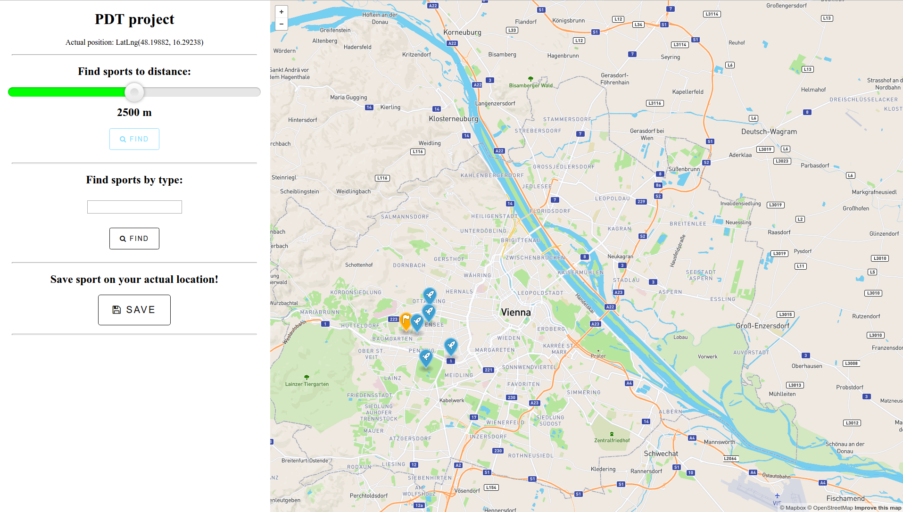

# PDT - Športoviská v Rakúsku

### Aplikácia

Pre zobrazovanie mapy som využil platformu [mapbox](https://www.mapbox.com/).
Aplikácia športoviská v Rakúsku je implementovaná ako webová aplikácia napísaná v jazyku ruby, využívajúc framework [rails](http://rubyonrails.org/).

Rails je štandardný MVC framework a z toho vyplýva, že pripojenie k databáze som riešil v modely, kde som výsledky query transformoval do GEOJSONu a cez kontorler posielal do view. Vo view som si pomocou javascriptu inicializoval mapu z mapboxu a popridával som vstupné polia a tlačidlá pre lepšie ovládanie aplikácie. 

##### Funkcie:
+ Nájdenie športovísk do určitej vzdialenosti od požadovaného miesta.
+ Zobrazenie športovísk od typu športoviska.
+ Vytvorenie nového športoviska na mape. (Pre uloženie do DB je potrebný prevod z lng/ltd čiže z EPSG:4326 do standardu EPSG:900913. Pri prevode som použil [tieto](https://gist.github.com/springmeyer/871897) vzorce, ktoré je možné nájsť vo viacerých zdrojoch. Pri prevode vniká istá odchýľka ktorú sa mi nepodarilo odstrániť.)



### Databáza
Ako databázu som si zvolil PostgreSQL do ktorej som naimportoval dáta vo formáte osm, ktoré sú vole dostupné na [openstreetmap](https://www.openstreetmap.org). Konkrétne sa jedná o dáta reprezentujúce Rakúsko. Aby som dokázal pracovať z geo dátami ako bod alebo polygon, potreboval som si do databázy nainštalovať rozšírenie PostGIS. 

### GEOJSON

Webová aplikácia poskytuje GET requesty so vstupnými parametrami pre získanie GEOJSONov.

* Navráti všetky športoviska vzdialené 400m od bodu definovaného prostredníctvom lng a ltd. 
http://localhost:3000/map/close_place?distance=400&lat=48.21254876091117&lng=16.370111703872677

```json
[{"type":"Feature","geometry":{"type":"Point","coordinates":[16.3748240044065,48.2117787011538]},"properties":{"title":"gymnastics","marker-color":"#3ca0d3","marker-size":"large","marker-symbol":"rocket"}},{"type":"Feature","geometry":{"type":"Point","coordinates":[16.3734522769676,48.212419817686]},"properties":{"title":"table_soccer","marker-color":"#3ca0d3","marker-size":"large","marker-symbol":"rocket"}},{"type":"Feature","geometry":{"type":"Point","coordinates":[16.3737447684241,48.2126268169959]},"properties":{"title":"billiards","marker-color":"#3ca0d3","marker-size":"large","marker-symbol":"rocket"}},{"type":"Feature","geometry":{"type":"Point","coordinates":[16.3709128294909,48.2150228120157]},"properties":{"title":"table_soccer","marker-color":"#3ca0d3","marker-size":"large","marker-symbol":"rocket"}}]
```

* Navráti športovisko na základe jeho typu.
http://localhost:3000/map/one_sport?sport=volleyball

```json
[{"type":"Feature","geometry":{"type":"Point","coordinates":[11.1914591157587,47.3229202781607]},"properties":{"title":null,"marker-color":"#29ef17","marker-size":"large","marker-symbol":"soccer"}},{"type":"Feature","geometry":{"type":"Point","coordinates":[13.1613880872021,47.3216192072362]},"properties":{"title":null,"marker-color":"#29ef17","marker-size":"large","marker-symbol":"soccer"}},{"type":"Feature","geometry":{"type":"Point","coordinates":[13.2046883212012,47.3249419104873]},"properties":{"title":"Volleyballplatz","marker-color":"#29ef17","marker-size":"large","marker-symbol":"soccer"}},{"type":"Feature","geometry":{"type":"Point","coordinates":[15.6590341689322,46.9329929712809]},"properties":{"title":"Volksschulturnsaal","marker-color":"#29ef17","marker-size":"large","marker-symbol":"soccer"}},{"type":"Feature","geometry":{"type":"Point","coordinates":[13.1944877714869,48.2710367731507]},"properties":{"title":null,"marker-color":"#29ef17","marker-size":"large","marker-symbol":"soccer"}},{"type":"Feature","geometry":{"type":"Point","coordinates":[14.2508669299075,48.1844202720541]},"properties":{"title":null,"marker-color":"#29ef17","marker-size":"large","marker-symbol":"soccer"}},{"type":"Feature","geometry":{"type":"Point","coordinates":[14.4726454327021,48.2206494008235]},"properties":{"title":null,"marker-color":"#29ef17","marker-size":"large","marker-symbol":"soccer"}},{"type":"Feature","geometry":{"type":"Point","coordinates":[15.0280347859899,48.7738301890787]},"properties":{"title":"Beachvolleyballplatz","marker-color":"#29ef17","marker-size":"large","marker-symbol":"soccer"}},{"type":"Feature","geometry":{"type":"Point","coordinates":[15.4519128478077,48.5904253051628]},"properties":{"title":"Beachvolleyball","marker-color":"#29ef17","marker-size":"large","marker-symbol":"soccer"}},{"type":"Feature","geometry":{"type":"Point","coordinates":[15.2743838287728,48.8103714792042]},"properties":{"title":null,"marker-color":"#29ef17","marker-size":"large","marker-symbol":"soccer"}}]
```